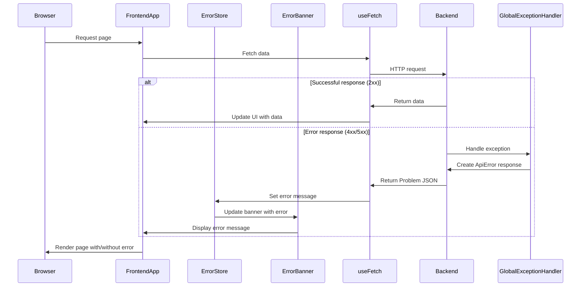

# Step 04 - Baseline Error Handling Implementation Tasks

After reviewing the requirements in `docs/plan/04-baseline-error-handling.md` and the architecture and coding guidelines, here's a detailed implementation plan for adding baseline error handling to both the backend and frontend.

## Analysis of Current State

The current implementation:
- Backend has no standardized error handling mechanism
- Frontend's `useFetch` hook has basic error handling but doesn't parse Problem JSON
- PublicTile displays errors directly in the component rather than using a global error banner

## Implementation Subtasks

### Backend Tasks

1. **Create ApiError Record**
   - Create a new Java record `ApiError` in package `ai.bluefields.oidcauthdemo.error`
   - Implement fields as specified: type, title, status, detail, timestamp
   - Add proper Javadoc comments
   - Ensure it follows RFC 7807 Problem JSON format

2. **Implement GlobalExceptionHandler**
   - Create a new class `GlobalExceptionHandler` with `@RestControllerAdvice` annotation
   - Implement method to handle generic `Exception` → `ApiError` with status 500
   - Add proper content type for Problem JSON (`application/problem+json`)
   - Add comprehensive Javadoc comments

3. **Add Error Classification for Spring Exceptions**
   - Add specific exception handlers for common Spring exceptions:
     - `HttpRequestMethodNotSupportedException` → 405
     - `NoHandlerFoundException` → 404
     - `HttpMediaTypeNotSupportedException` → 415
   - Return appropriate ApiError objects with descriptive messages

4. **Create Backend Tests**
   - Create test class `GlobalExceptionHandlerTest`
   - Implement test for non-existent URL `/bad` to verify 404 Problem JSON response
   - Implement test for forced `RuntimeException` to verify 500 mapping
   - Ensure tests maintain coverage thresholds

### Frontend Tasks

5. **Create Error Store**
   - Create a new Zustand store in `frontend/src/store/errorStore.ts`
   - Implement actions for setting and clearing error messages
   - Add proper TSDoc comments

6. **Enhance useFetch Hook**
   - Update `useFetch.ts` to detect non-2xx responses
   - Add logic to parse Problem JSON format
   - Integrate with error store to push error messages
   - Maintain backward compatibility with existing components
   - Add comprehensive TSDoc comments

7. **Create ErrorBanner Component**
   - Create new component `frontend/src/components/ErrorBanner.tsx`
   - Implement fixed-position alert using shadcn/ui Alert component
   - Add Framer Motion animations for fade in/out
   - Connect to error store to display messages
   - Add proper TSDoc comments

8. **Integrate with PublicTile**
   - Update PublicTile to use the global error banner instead of local error display
   - Ensure it maintains the same user experience but with improved error presentation

9. **Create Frontend Tests**
   - Create test for ErrorBanner component
   - Update useFetch tests to verify Problem JSON parsing
   - Add test mocking 500 response to ensure banner renders with correct message
   - Ensure tests maintain coverage thresholds

### Documentation Tasks

10. **Create Error Handling Documentation**
    - Create new file `docs/error-handling.md`
    - Document Problem JSON format
    - Explain GlobalExceptionHandler functionality
    - Document ErrorBanner usage and integration
    - Include examples of error responses

11. **Update CHANGELOG**
    - Add entry to CHANGELOG.md: "**Step 04** – Baseline error handling added."

12. **Add Code Comments**
    - Ensure Javadoc on `GlobalExceptionHandler`
    - Add TSDoc on `useFetch` error handling
    - Add TSDoc on `ErrorBanner` component

## Implementation Sequence

The implementation should follow this sequence:

1. Backend error handling (tasks 1-3)
2. Backend tests (task 4)
3. Frontend error store and hook enhancement (tasks 5-6)
4. Frontend UI components (tasks 7-8)
5. Frontend tests (task 9)
6. Documentation (tasks 10-12)

## Technical Considerations

1. **RFC 7807 Compliance**
   - The ApiError record must follow the Problem Details for HTTP APIs standard
   - Fields should match the standard: type, title, status, detail, instance (optional)
   - Content type should be `application/problem+json`

2. **Error Message Standardization**
   - User-facing error messages should be clear and actionable
   - Technical details should be logged but not exposed to users
   - For 500 errors, use generic message "Service unavailable—please retry"

3. **Performance Considerations**
   - ErrorBanner should not cause unnecessary re-renders
   - Error store should be lightweight and efficient

4. **Testing Strategy**
   - Backend tests should verify correct status codes and response formats
   - Frontend tests should mock API responses to test error handling
   - Coverage should remain at or above 80%

## Error Handling Flow

## Acceptance Criteria Verification

1. **Stopping backend while frontend is running and refreshing page shows error banner with user‑friendly message**
   - This will be verified by implementing the ErrorBanner and connecting it to the error store
   - The useFetch hook will detect the connection failure and update the store

2. **Backend returns Problem JSON for uncaught exceptions**
   - This will be verified through the GlobalExceptionHandler implementation
   - Tests will confirm proper format and status codes

3. **All unit and UI tests pass; coverage thresholds remain ≥ 80%**
   - New tests will be added for all new components and functionality
   - Existing tests will be updated as needed